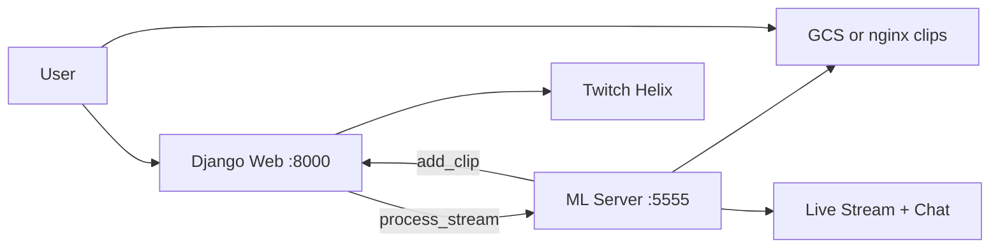

# Twitch Stream Highlights Detection with Machine Learning
This repository contains a web app + server side app for auto highlights generation during a twitch stream live!
I utilize the power of machine learning to extract features from sound, motion and live chat to predict highlights from video game streams on twitch! <br>
<b>You can find blog post about the problem [Here](https://artkulakov.medium.com/how-i-created-an-app-for-live-stream-highlight-detection-for-twitch-532f4027987e)</b>

For that I use the combination of the following features:


* For audio tagging I use the code from [this repository](https://github.com/qiuqiangkong/audioset_tagging_cnn)
* For chat sentiment analysis I use transformers, same as in [this tutorial](https://huggingface.co/transformers/quicktour.html)
* For movement scoring I use the approach similar to the approach I proposed in [this repository](https://github.com/artkulak/workout-movement-counting)
  the Dense Optical Flow algorithm with a simple CNN network written in PyTorch. As you can see, it is pretty easy to get the idea of what one push-up is, if we look at how frames are converted to Dense Optical Flow representation in my algorithm. Thus, Dense Optical Flow converts frames to color coded representation, and CNN solves a multiclass problem, which is to classify each frame as move down, move up or not a move. Those features are extracted in real time for 10 second clips, after that they are passed to the metamodel, which predicts the probability of the clip to be a highlight. As the metamodel I chose Logistic Regression, because it is fast and easily interpritable! Here are the feature importances of the final meta model:


To run the web app and the server follow the instructions below.

## Documentation

Full architecture, process flows, and deployment guides live in the project docs and GitHub Wiki:

| Resource | Link |
|----------|------|
| **Docs index** | [`docs/README.md`](docs/README.md) |
| **GitHub Wiki** | [hefftv/VOD-tags/wiki](https://github.com/hefftv/VOD-tags/wiki) *(publish with [`scripts/publish-wiki.sh`](scripts/publish-wiki.sh))* |
| Architecture | [`docs/wiki/Architecture.md`](docs/wiki/Architecture.md) |
| Process flow | [`docs/wiki/Process-Flow.md`](docs/wiki/Process-Flow.md) |
| ML pipeline | [`docs/wiki/ML-Pipeline.md`](docs/wiki/ML-Pipeline.md) |
| Deployment | [`docs/wiki/Deployment.md`](docs/wiki/Deployment.md) |
| Configuration | [`docs/wiki/Configuration.md`](docs/wiki/Configuration.md) |

### System overview



## Repository structure

* Branch `main` contains the web app and ML server
* Branch `Feature/server` contains the original server-only history
* Branch `Feature/metamodel` contains the code for training the metamodel
* Branch `Feature/movement` contains some POC code for the movement model to work

## Instructions

The app consists of two parts: the server part (the server is responsible for processing live broadcasts and running machine learning models) and the client part (the web application is responsible for communicating with the server).
To install two separate components, we will need access to the Google Cloud platform, namely Google Cloud Compute and Google Cloud Storage.
After creating 2 cloud instances and setting up the Firewall, you can start setting up.

1. Select one of the machines as the environment for the web application and clone the main branch of the following repository: [Link](https://github.com/artkulak/stream-highlights-detection)
2.Using the `pip install –r requirements.txt` command, install all the necessary libraries for the web application to work
3. Install the server on another machine, for this we clone the branch: [Link](https://github.com/artkulak/stream-highlights-detection/tree/Feature/server)
4. Using the `pip install –r requirements.txt` command, install all the necessary libraries for the server to work.
5. Now you need to create a bucket in Google Cloud Storage and make it public. After setting up and creating a bucket, remember its name.
6. Set up config for the web application, for this open the file `webapp/viewer/config.py` and enter the following data 


7. Set up config for the server, which is located in `server/config.py`


8. Now we can launch the web application and the server. To launch the web application in the root directory of the repository, enter the command:

`python manage.py runserver 0.0.0.0:5555`

To start the server in the root directory of the repository, enter the command:

`python server.py`

## Deployment modes

The original project targeted **GCP (GCE + public GCS bucket + gsutil)**. That path is still the **default** server behavior. Local and other cloud environments reuse the same code via env vars — nothing replaces GCP, it scaffolds off it.

| Mode | Where | Clip storage | Web ↔ ML wiring |
|------|-------|--------------|-----------------|
| **GCP (original)** | 2× GCE VMs, firewall | `gsutil cp` → public GCS bucket | Public IPs in `server/config.py` or env |
| **Local containers** | Docker/Podman Compose | `CLIP_STORAGE_BACKEND=local` + nginx `:8080` | Compose DNS (`ml-server`, `web`) |
| **Cloud (generic)** | Any host/K8s | Keep `gcp` + GCS, or `local` + CDN/nginx | Set `WEBAPP_*` / `ML_SERVER_*` to service URLs |

### GCP (original — unchanged behavior)

1. Create two GCE instances (web + ML server) and open firewall for web port + ML `:5555`.
2. Create a **public GCS bucket**; note the bucket name.
3. Configure via env or `server/config.py` fields:

| Original field | Env override |
|----------------|--------------|
| `google_cloud_storage_bucket_name` | `GCS_BUCKET_NAME` |
| `webapp_public_ip` | `WEBAPP_PUBLIC_IP` |
| `webapp_public_port` | `WEBAPP_PUBLIC_PORT` |
| `nickname` / `oauth_token` / `secret_id` | `TWITCH_CHAT_NICKNAME` / `TWITCH_OAUTH_TOKEN` / `TWITCH_SECRET_ID` |

4. Ensure `gsutil` is available on the ML VM (preinstalled on GCE with Cloud SDK).
5. Run web on VM 1, `python server.py` from `server/` on VM 2.
6. Clips upload to `gs://{bucket}/{clip}.mp4` and play at `https://storage.googleapis.com/{bucket}/{clip}.mp4`.

`CLIP_STORAGE_BACKEND` defaults to **`gcp`** — no change required for existing GCP deploys.

### Local containers (web app)

Works with **Docker Compose** or **Podman Compose**. Copy env defaults, then bring the stack up with either engine:

```bash
cp .env.example .env   # set TWITCH_* (optional); ML host optional

# Web app only
docker compose up --build

# Full local stack (web + ML server + clip hosting)
# Set ML_SERVER_HOST=ml-server in .env, plus Twitch credentials below.
docker compose --profile full up --build
```

| Service | URL | Profile |
|---------|-----|---------|
| Web app | http://localhost:8000 | default |
| ML server | http://localhost:5555 | `full` |
| Clip playback | http://localhost:8080 | `full` |

Open http://localhost:8000. SQLite persists in the `sqlite_data` volume.

**Web-only:** leave `ML_SERVER_HOST` blank — UI works, highlights are not generated.

**Full stack:** set these in `.env`:
- `CLIP_STORAGE_BACKEND=local`
- `ML_SERVER_HOST=ml-server`
- `TWITCH_CLIENT_ID` / `TWITCH_SECRET_ID` (Helix API for stream lookup)
- `TWITCH_CHAT_NICKNAME` / `TWITCH_OAUTH_TOKEN` (IRC chat detector on ML server)
- Target channel must be **live** on Twitch for recording to start

Clips are written to a shared volume and served at `CLIP_PUBLIC_BASE_URL` (default `http://localhost:8080`).

**Containerized GCP:** build ML image with gsutil support and keep `CLIP_STORAGE_BACKEND=gcp`:

```bash
docker build -f Dockerfile.ml --build-arg INSTALL_GCLOUD=true -t vod-tags-ml .
# mount GOOGLE_APPLICATION_CREDENTIALS, set GCS_BUCKET_NAME + WEBAPP_PUBLIC_*
```

Notes for Podman:
- Images use fully qualified names (`docker.io/library/...`) and local tags (`localhost/vod-tags-*:local`).
- Rootless Podman is fine on ports 8000/8080/5555; named volumes avoid SELinux bind-mount `:Z` issues.
- On Windows/macOS, start a Podman machine first (`podman machine start`).
- The ML server image is large (TensorFlow + PyTorch) and targets Python 3.8.

## App overview

When navigating to the public IP address of the web application, you will see the login panel, in which you can enter the data of an existing user or create a new one.
I didn't erase the SQLite database so you can use my credentials to login, `user: artkulak password: 123456`. If you wish to create a new user you can either do that from django admin panel or erase the `webapp/db.sqlite3` database and do basic django user creation process from scratch.

When you are logged in, you can type the stream name you want to track in the following field:


The stream will appear just below:


At this moment django had sent a request to the server and it started to process highlights, if you had done everything correctly they will start to appear on the stream page.


You can also delete the stream with a Trash button in the upper right corner.

Code Safety is yet TBD. (Link Removed)

