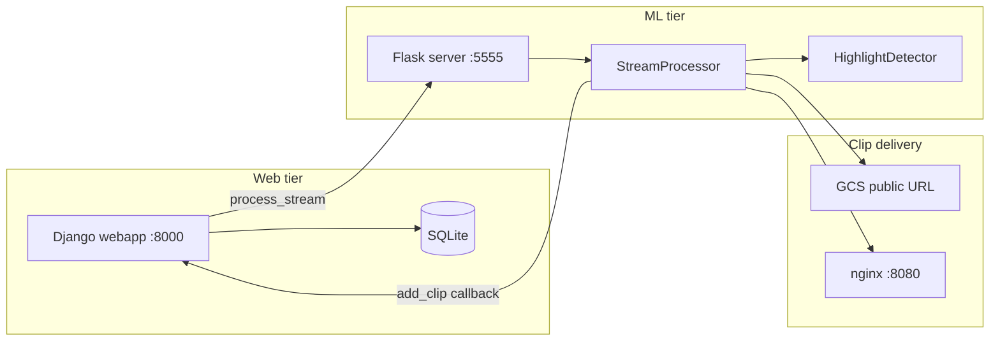
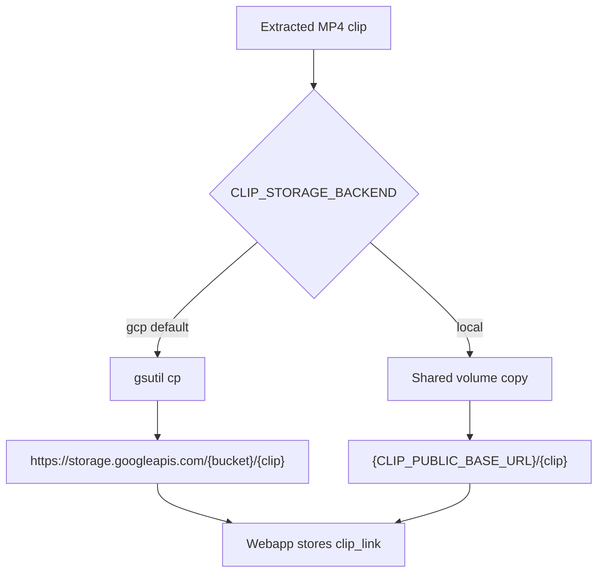
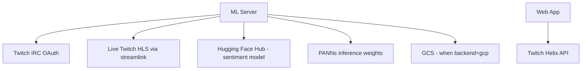
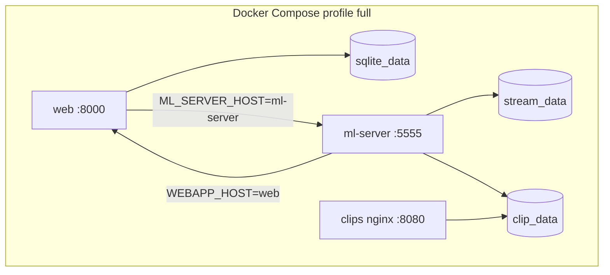
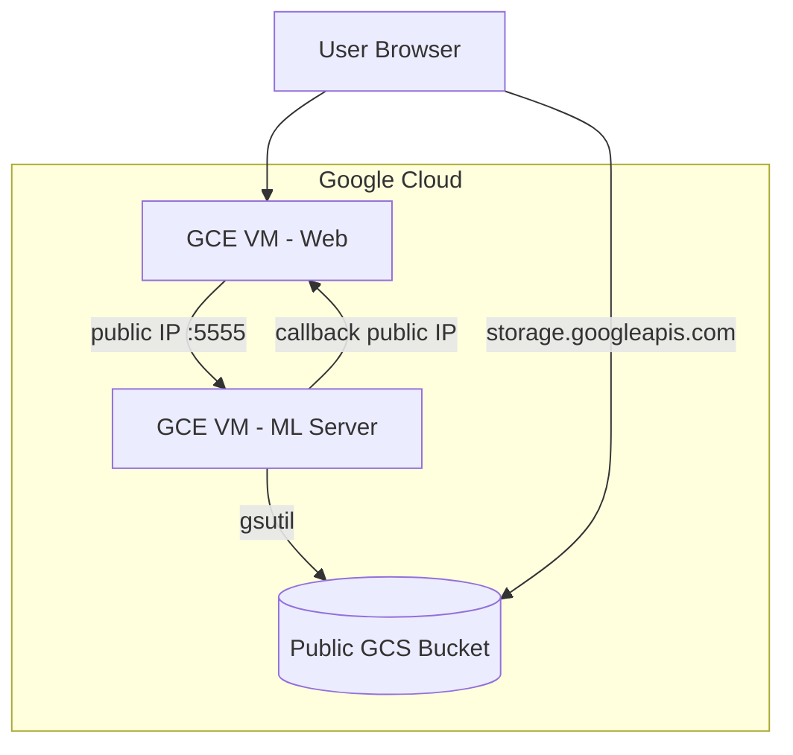

# Architecture

VOD Tags splits responsibilities between a **web client** (Django) and an **ML server** (Flask). They communicate over HTTP; clip video is served from object storage or a static file host reachable by the user's browser.

## System components

## Web app (`webapp/`)

| Piece | Location | Purpose |
|-------|----------|---------|
| **Entry** | `manage.py`, `entrypoint.sh` | Migrations + dev server / container boot |
| **Settings** | `highlights/settings.py` | Django config; env-based secrets |
| **Views** | `viewer/views.py` | Login, add stream, clip callback, stream page |
| **Models** | `viewer/models.py` | `Stream`, `StreamHighlight` |
| **Config** | `viewer/config.py` | Twitch Helix + ML server target |
| **Templates** | `viewer/templates/` | Login, dashboard, stream/clip player |

### Key routes

| Route | Method | Caller | Action |
|-------|--------|--------|--------|
| `/` | GET/POST | User | Login / stream list |
| `/add_stream/` | POST | User | Create stream, trigger ML |
| `/add_clip/` | GET | ML server | Store highlight clip URL |
| `/jobs/<job_id>` | GET | Operator | ML job status (artifact path, clip count) |
| `/stream/<id>` | GET | User | View clips for a stream |
| `/delete_stream/<user>/<link>` | GET | User | Remove stream + highlights |

### Database

SQLite stores:

- **Stream** — Twitch channel name, display name, owning user
- **StreamHighlight** — public `clip_link` URL, stream, user

No clip binary is stored in the DB; only URLs.

## ML server (`server/`)

| Piece | Location | Purpose |
|-------|----------|---------|
| **Entry** | `server.py` | Flask app, `/process_stream` handler |
| **Orchestration** | `processor.py` | Download, predict, clip, publish, callback |
| **Detectors** | `detector/` | Parallel chat/sound/movement feature writers |
| **Recorder** | `twitch_stream_recorder/` | streamlink + ffmpeg live capture |
| **Models** | `model.joblib`, `standard_scaler.joblib`, `effnet.h5` | Metamodel + movement CNN |

### ML server API

| Endpoint | Method | Params | Response |
|----------|--------|--------|----------|
| `/health` | GET | — | `{"status": "ok"}` |
| `/process_stream` | GET | `stream_link`, `user_name` | `202` — starts background job |
| `/jobs` | GET | — | List active jobs |
| `/jobs/<job_id>` | GET | — | Job status + artifact dir |

## Storage backends

Clip publishing is selected by `CLIP_STORAGE_BACKEND`:

| Backend | Default | Use case |
|---------|---------|----------|
| `gcp` | Yes | Original GCE deploy; public GCS bucket |
| `local` | Compose `--profile full` | Dev; nginx serves `/clips` volume |

GCP behavior (`save_clip_to_gs`, `gsutil`, GCS URLs) is unchanged when `CLIP_STORAGE_BACKEND=gcp`.

## External dependencies

| Service | Required for | Credentials |
|---------|--------------|-------------|
| Twitch Helix | Stream lookup (web) | `TWITCH_CLIENT_ID`, `TWITCH_SECRET_ID` |
| Twitch IRC | Chat detector | `TWITCH_CHAT_NICKNAME`, `TWITCH_OAUTH_TOKEN` |
| Live stream | Recording | Channel must be **live** |
| Hugging Face | Chat sentiment | Auto-download on first run |
| GCS + gsutil | GCP clip hosting | Bucket name + Cloud SDK auth |

## Container topology (local full stack)

## GCP topology (original)

Two VMs, firewall rules for web port and ML `:5555`, and a **public** GCS bucket for browser playback.

## Technology stack

| Layer | Web | ML |
|-------|-----|-----|
| Language | Python 3.11 | Python 3.8 |
| Framework | Django 5.2 | Flask |
| ML libs | — | TensorFlow 2.3, PyTorch, scikit-learn, transformers |
| Media | — | ffmpeg, streamlink, OpenCV, librosa |
| DB | SQLite | CSV feature files (runtime) |

See [ML Pipeline](ML-Pipeline) for detector internals and [Process Flow](Process-Flow) for the runtime sequence.
