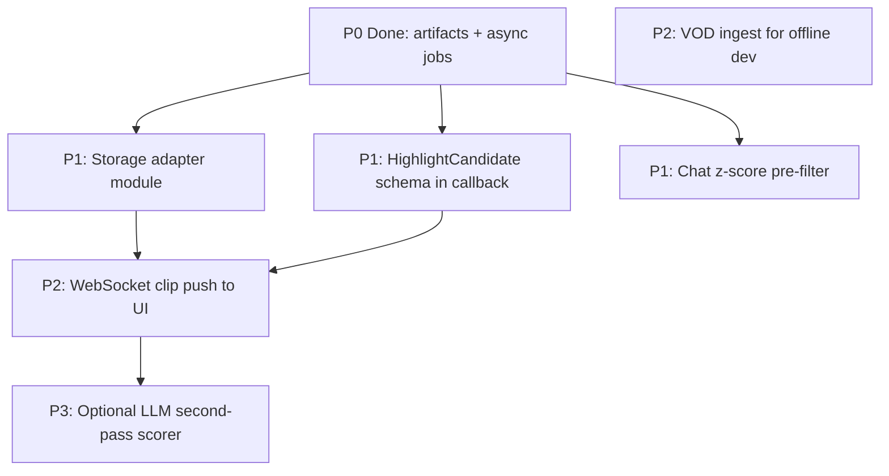

# Competitive Research

Landscape analysis of open-source Twitch/stream highlight tools, patterns worth adopting, and how VOD Tags compares.

## Where VOD Tags fits

VOD Tags is optimized for **live** Twitch capture with a **classic multimodal ML stack** (chat + PANNs audio + optical-flow movement → logistic regression metamodel). Most modern alternatives target **VOD clipping** with LLM scoring.

```mermaid
quadrantChart
  title Highlight tools by mode and scoring approach
  x Live capture --> VOD ingest
  y Classical ML --> LLM-first
  VOD Tags: [0.15, 0.2]
  TwitchSnipBot: [0.2, 0.35]
  clips-studio: [0.85, 0.55]
  hotclip: [0.75, 0.9]
  clip-forge: [0.9, 0.85]
  AWS TAMS: [0.1, 0.7]
```

## Comparable projects

| Project | Live? | Signals | Scoring | Notable pattern |
|---------|-------|---------|---------|-----------------|
| **[VOD Tags](https://github.com/hefftv/VOD-tags)** | Yes | Chat + audio + motion | sklearn LR | GCP default + live streamlink |
| [TwitchSnipBot](https://github.com/bihanikeshav/TwitchSnipBot) | Yes | Chat (12-d features) | z-score + LSTM/ONNX | Browser ffmpeg.wasm + FastAPI |
| [clips-studio / Clips Kitty](https://github.com/ColinGPT9/clips-studio) | VOD | Speech + visual + chat replay | Fused 0–100 | Multimodal fusion, local-first |
| [clipsmith](https://github.com/ricardogr07/clipsmith) | VOD | Whisper + chat | LLM selector | Staged CLI pipeline + `work/<id>/` |
| [hotclip](https://deepwiki.com/xixihhhh/hotclip/4-highlight-detection) | VOD | 6 media signals + transcript | 2-stage LLM funnel | [DeepWiki signal table](https://deepwiki.com/xixihhhh/hotclip/4-highlight-detection) |
| [clip-forge](https://github.com/JeremySNR/clip-forge) | VOD | Transcript + vision | LLM + virality rubric | Two-pass scoring + ending review |
| [Clippos](https://github.com/dylan-buck/clippos) | VOD | Whisper + optical flow | Agent rubric | Media engine vs judgment split |
| [lxgic-clipper](https://github.com/lxgicstudios/lxgic-clipper) | Live record | Audio + chat + scene | Shell heuristics | Cron + per-stage scripts |
| [twitch-toolkit](https://github.com/teseo/twitch-toolkit) | VOD | Whisper + song skip | LLM 1–10 chunks | Skip music before transcribe |
| [AWS TAMS sample](https://github.com/aws-samples/sample-time-addressable-media-store-inference) | Live segments | Whisper + VLM | Key-moments agent | SQS + DynamoDB segment queue |
| [Live Broadcast Intelligence Platform](https://github.com/danieldotwav/Live-Broadcast-Intelligence-Platform) | Live | Transcript chunks | Multi-agent | Kafka + Redis + parallel agents |

## DeepWiki as a research tool

[DeepWiki](https://deepwiki.com/) auto-generates architecture docs and Q&A from repositories. Useful for studying peers:

- [hotclip — Highlight Detection](https://deepwiki.com/xixihhhh/hotclip/4-highlight-detection) — signal table + LLM funnel
- [hefftv/VOD-tags](https://deepwiki.com/hefftv/VOD-tags) — our repo (index may take time)

Steer generation for this repo with [`.devin/wiki.json`](https://github.com/hefftv/VOD-tags/blob/main/.devin/wiki.json) in the repository root.

## Patterns adopted in VOD Tags

| Pattern | Source inspiration | Implementation |
|---------|-------------------|----------------|
| **Per-job artifact directory** | clipsmith, clip-forge | `{STREAMS_ROOT}/jobs/{stream_uid}/` with `chat.csv`, `movement.csv`, `sound.csv`, `merged.csv` |
| **Async job queue** | AWS TAMS, LBIP | `server/jobs.py` — `/process_stream` returns `202` + `job_id`; `GET /jobs/{id}` for status |
| **Storage adapter** | GCP original + local scaffold | `CLIP_STORAGE_BACKEND=gcp\|local` → `publish_clip()` |
| **Env-based multi-deploy** | Common cloud-native | GCP defaults preserved; Compose overrides via env |

### Artifact layout

```
{STREAMS_ROOT}/
  recorded/{channel}/{stream_uid}.mp4    # live recording (unchanged)
  jobs/{stream_uid}/
    chat.csv
    movement.csv
    sound.csv
    merged.csv
    clips/                               # optional future use
```

### Job API

| Endpoint | Response |
|----------|----------|
| `GET /process_stream?stream_link=&user_name=` | `202` + job metadata |
| `GET /jobs/{job_id}` | Job status, clip count, artifact path |
| `GET /jobs` | List in-memory jobs |

The Django web app still fire-and-forgets `GET /process_stream`; `202` is compatible with the existing client.

## Patterns to adopt next

Priority order from competitive analysis:



| Priority | Pattern | Source | Benefit |
|----------|---------|--------|---------|
| **P1** | Storage `Protocol` class | clipsmith, AWS | Clean GCS / local / future S3 |
| **P1** | Structured callback (`score`, `start_sec`) | hotclip, AWS TAMS | Richer UI, analytics |
| **P1** | Chat z-score spike detector | TwitchSnipBot | Faster first clips, cheap signal |
| **P2** | SSE/WebSocket on new clips | TwitchSnipBot, LBIP | Live stream page updates |
| **P2** | VOD + chat replay ingest | clips-studio | Test without live stream |
| **P3** | LLM quality gate (optional) | hotclip, clip-forge | Higher clip quality; keep LR as default |

## What not to copy blindly

- **Full LLM-first pipelines** — higher latency/cost; our LR metamodel is intentional for live use.
- **VOD-only desktop apps** — different ingest model (no growing MP4 + streamlink).
- **Replacing GCS** — keep as default; extend via storage adapter only.

## References

- [Original VOD Tags blog post](https://artkulakov.medium.com/how-i-created-an-app-for-live-stream-highlight-detection-for-twitch-532f4027987e)
- [DeepWiki docs](https://docs.devin.ai/work-with-devin/deepwiki)
- [PANNs / AudioSet tagging](https://github.com/qiuqiangkong/audioset_tagging_cnn)

See also: [Architecture](Architecture) · [ML Pipeline](ML-Pipeline) · [Deployment](Deployment)
