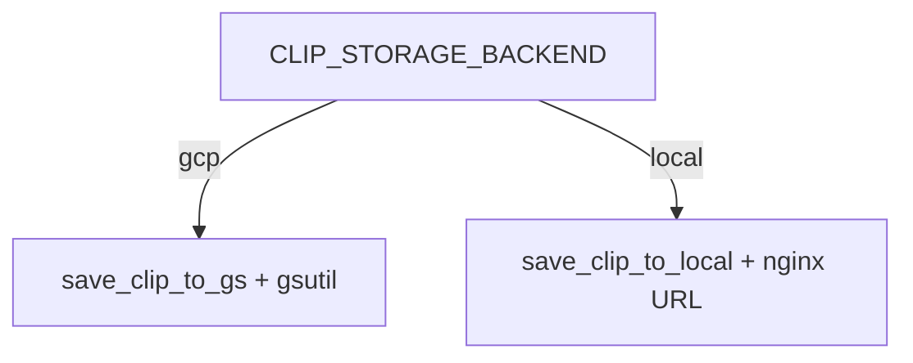
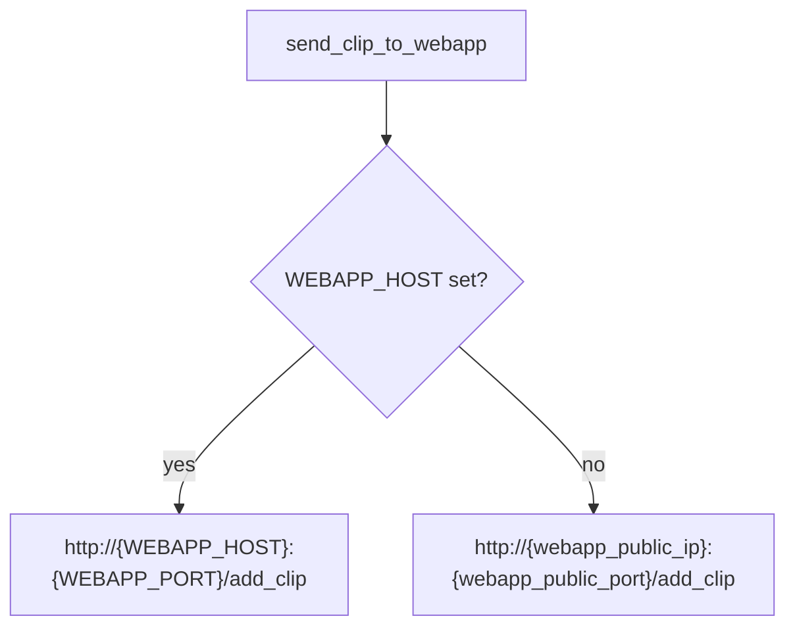

# Configuration

All runtime settings can be supplied via **environment variables**. Original `config.py` field names are preserved on the server; env vars override them without breaking GCP deploys.

## Deployment mode switch

| Variable | Default | Values | Effect |
|----------|---------|--------|--------|
| `CLIP_STORAGE_BACKEND` | `gcp` | `gcp`, `local` | GCS+gsutil vs volume+nginx |



---

## Web app (`webapp/viewer/config.py`)

| Env var | Fallback | Purpose |
|---------|----------|---------|
| `TWITCH_CLIENT_ID` | `TWITCH-CLIENT-ID` | Twitch Helix client ID |
| `TWITCH_SECRET_ID` | `TWITCH-SECRET-ID` | Twitch Helix secret |
| `ML_SERVER_HOST` | `SERVER_IP` | ML server hostname/IP |
| `ML_SERVER_PORT` | `SERVER_PORT` → `5555` | ML server port |

### Django settings (`webapp/highlights/settings.py`)

| Env var | Default | Purpose |
|---------|---------|---------|
| `DJANGO_SECRET_KEY` | dev placeholder | Django secret |
| `DJANGO_DEBUG` | `True` | Debug mode |
| `DJANGO_ALLOWED_HOSTS` | `*` | Comma-separated hosts |
| `DJANGO_DB_PATH` | `webapp/db.sqlite3` | SQLite file path |

---

## ML server (`server/config.py`)

### GCP / original fields

| Original field | Env override | Default | Purpose |
|----------------|--------------|---------|---------|
| `google_cloud_storage_bucket_name` | `GCS_BUCKET_NAME` | `YOUR-GOOGLE-CLOUD-STORAGE-BUCKET-NAME` | GCS bucket |
| `webapp_public_ip` | `WEBAPP_PUBLIC_IP` | `34.122.9.136` | Web callback host (GCP) |
| `webapp_public_port` | `WEBAPP_PUBLIC_PORT` | `5555` | Web callback port (GCP) |
| `nickname` | `TWITCH_CHAT_NICKNAME` | `YOUR-TWITCH-NAME` | IRC nickname |
| `secret_id` | `TWITCH_SECRET_ID` | `YOUR-TWITCH-SECRET-ID` | Twitch secret |
| `oauth_token` | `TWITCH_OAUTH_TOKEN` | `YOUR-TWITCH-OAUTH-TOKEN` | IRC OAuth token |

### Multi-environment fields

| Env var | Default | Purpose |
|---------|---------|---------|
| `STREAMS_ROOT` | `../../streams` | Recording + CSV workspace |
| `CLIPS_ROOT` | `/clips` | Local clip publish directory |
| `CLIP_PUBLIC_BASE_URL` | `http://localhost:8080` | Browser-facing clip base URL |
| `PANNS_DATA_DIR` | `/app/panns_data` | AudioSet label CSV directory |
| `WEBAPP_HOST` | — | Overrides callback host (containers) |
| `WEBAPP_PORT` | — | Overrides callback port (containers) |
| `ML_SERVER_PORT` | `5555` | Flask listen port |
| `FLASK_DEBUG` | `True` | Flask debug mode |

### Callback resolution



---

## Stream recorder (`server/twitch_stream_recorder/downloader_config.py`)

| Env var | Default | Purpose |
|---------|---------|---------|
| `STREAMS_ROOT` | via Config | Root for `recorded/` and `processed/` |
| `TWITCH_CLIENT_ID` | empty | Helix client for streamlink auth |
| `TWITCH_SECRET_ID` | empty | Helix secret |
| `TWITCH_DEFAULT_USERNAME` | `ninja` | Default channel (CLI override via `--username`) |

---

## Example configurations

### GCP production (original)

**Web VM `.env`:**

```env
TWITCH_CLIENT_ID=your-client-id
TWITCH_SECRET_ID=your-secret
ML_SERVER_HOST=34.x.x.x
ML_SERVER_PORT=5555
DJANGO_SECRET_KEY=production-secret
DJANGO_DEBUG=False
DJANGO_ALLOWED_HOSTS=your-domain.com
```

**ML VM `.env`:**

```env
CLIP_STORAGE_BACKEND=gcp
GCS_BUCKET_NAME=my-public-highlights-bucket
WEBAPP_PUBLIC_IP=34.y.y.y
WEBAPP_PUBLIC_PORT=5555
TWITCH_CLIENT_ID=your-client-id
TWITCH_SECRET_ID=your-secret
TWITCH_CHAT_NICKNAME=your-bot-name
TWITCH_OAUTH_TOKEN=oauth:xxxxx
```

### Local full stack (Docker)

```env
CLIP_STORAGE_BACKEND=local
ML_SERVER_HOST=ml-server
WEBAPP_HOST=web
WEBAPP_PORT=8000
CLIP_PUBLIC_BASE_URL=http://localhost:8080
TWITCH_CLIENT_ID=...
TWITCH_SECRET_ID=...
TWITCH_CHAT_NICKNAME=...
TWITCH_OAUTH_TOKEN=...
```

### Web-only local

```env
ML_SERVER_HOST=
TWITCH_CLIENT_ID=...
TWITCH_SECRET_ID=...
```

---

## Twitch credential matrix

| Credential | Used by | API |
|------------|---------|-----|
| `TWITCH_CLIENT_ID` + `TWITCH_SECRET_ID` | Web (Helix), recorder | REST Helix |
| `TWITCH_CHAT_NICKNAME` + `TWITCH_OAUTH_TOKEN` | Chat detector | IRC |

These are **different** from each other — you need both for full highlight detection.

Obtain credentials at [Twitch Developer Console](https://dev.twitch.tv/console/apps).

---

## GCS authentication (containers)

When `CLIP_STORAGE_BACKEND=gcp` in containers:

1. Build with `INSTALL_GCLOUD=true`
2. Mount service account JSON
3. Set `GOOGLE_APPLICATION_CREDENTIALS=/secrets/gcp.json`

On GCE VMs, the default service account or `gcloud auth` is typically sufficient.

---

## File reference

Copy `.env.example` to `.env` at repo root for Compose:

```bash
cp .env.example .env
```

See also [Deployment](Deployment) for mode-specific setup steps.
