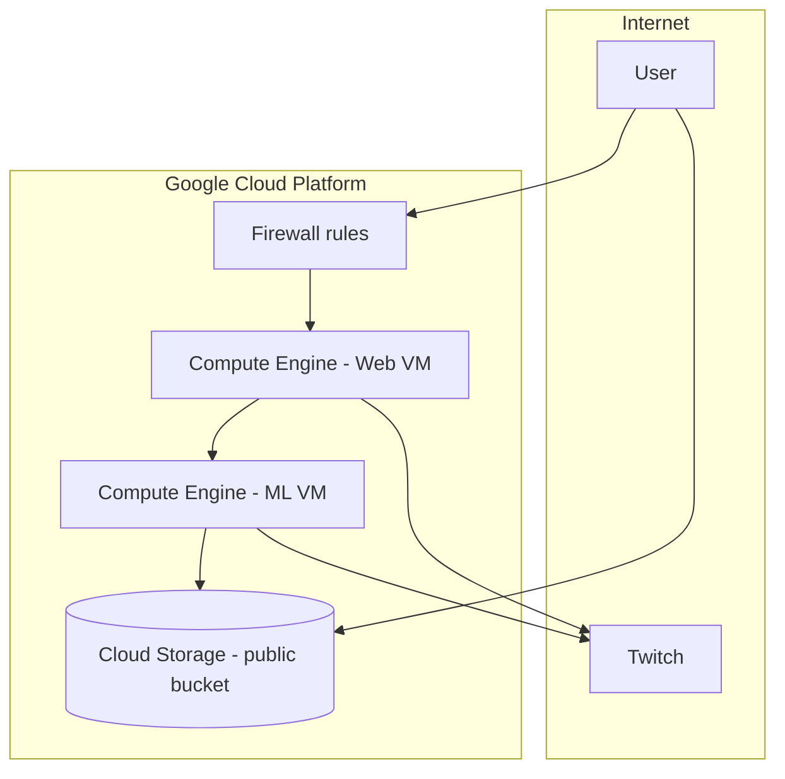
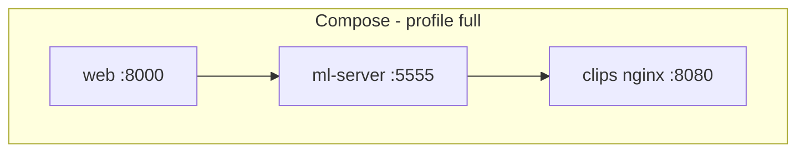

# Deployment

VOD Tags supports three deployment patterns. **GCP is the original default**; local containers and other clouds reuse the same code through environment variables.

## Comparison

| | GCP (original) | Local containers | Cloud generic |
|--|----------------|------------------|---------------|
| **Compute** | 2× GCE VMs | Docker/Podman Compose | Any VM/K8s |
| **Web port** | 5555 (README) / 8000 (containers) | 8000 | Your choice |
| **ML port** | 5555 | 5555 | 5555 |
| **Clip storage** | Public GCS + gsutil | nginx volume | GCS or CDN |
| **Default backend** | `CLIP_STORAGE_BACKEND=gcp` | `local` in full profile | Configure per host |
| **Service discovery** | Public IPs | Compose DNS | DNS / ingress |

## GCP (original default)

The original README describes a two-VM Google Cloud setup. **This path is unchanged.**

### Topology



### GCP products used

| Product | Purpose |
|---------|---------|
| **Compute Engine** | Host web app and ML server (separate VMs) |
| **Cloud Storage** | Public bucket for highlight MP4s |
| **Cloud SDK / gsutil** | Upload clips from ML VM |
| **VPC Firewall** | Allow web port + ML `:5555` |

### Setup checklist

1. Create **two GCE instances** (web + ML). ML instance benefits from more CPU/RAM.
2. Configure **firewall**: inbound TCP to web port and ML `:5555`.
3. Create a **GCS bucket** and make it **public** (or use uniform public read on objects).
4. Install dependencies on each VM (`pip install -r requirements.txt`; ML also needs `server/requirements.txt`).
5. Install **Cloud SDK** on ML VM (`gsutil` available).
6. Configure server (env or `server/config.py`):

   | Field | Example |
   |-------|---------|
   | `GCS_BUCKET_NAME` | `my-highlights-bucket` |
   | `WEBAPP_PUBLIC_IP` | Web VM external IP |
   | `WEBAPP_PUBLIC_PORT` | `5555` |
   | Twitch OAuth + Helix creds | See [Configuration](Configuration) |

7. Start web: `python manage.py runserver 0.0.0.0:5555` (from `webapp/`)
8. Start ML: `python server.py` (from `server/`)

Clips appear at `https://storage.googleapis.com/{bucket}/{clip}.mp4`.

### Config screenshots (original)

Web config:


Server config:


Env var equivalents are documented in [Configuration](Configuration).

---

## Local containers

Uses **Docker Compose** or **Podman Compose**. Supports web-only or full stack.

### Services



| Service | Image | Profile | Port |
|---------|-------|---------|------|
| `web` | `Dockerfile` | default | 8000 |
| `ml-server` | `Dockerfile.ml` | `full` | 5555 |
| `clips` | nginx:alpine | `full` | 8080 |

### Quick start

```bash
cp .env.example .env

# Web only
docker compose up --build

# Full stack
# Set in .env: CLIP_STORAGE_BACKEND=local, ML_SERVER_HOST=ml-server, Twitch creds
docker compose --profile full up --build
```

Podman equivalent:

```bash
podman compose --profile full up --build
```

### Local `.env` for full stack

```env
CLIP_STORAGE_BACKEND=local
ML_SERVER_HOST=ml-server
WEBAPP_HOST=web
WEBAPP_PORT=8000
CLIP_PUBLIC_BASE_URL=http://localhost:8080
TWITCH_CLIENT_ID=...
TWITCH_SECRET_ID=...
TWITCH_CHAT_NICKNAME=...
TWITCH_OAUTH_TOKEN=...
```

### Volumes

| Volume | Mount | Purpose |
|--------|-------|---------|
| `sqlite_data` | web `/app/webapp/data` | Persistent SQLite |
| `stream_data` | ml `/streams` | Live recordings + CSVs |
| `clip_data` | ml `/clips` + nginx | Published highlight MP4s |

---

## Cloud generic

Any cloud (AWS, Azure, Fly.io, bare metal) can run the same containers or bare Python deploys.

### Option A — Keep GCP storage

Run containers anywhere; set:

```env
CLIP_STORAGE_BACKEND=gcp
GCS_BUCKET_NAME=your-bucket
GOOGLE_APPLICATION_CREDENTIALS=/path/to/service-account.json
```

Build ML image with gsutil:

```bash
docker build -f Dockerfile.ml --build-arg INSTALL_GCLOUD=true -t vod-tags-ml .
```

### Option B — nginx / object storage

Use `CLIP_STORAGE_BACKEND=local` and front nginx with a CDN, or adapt `save_clip_to_local()` pattern for S3-compatible storage.

### Wiring checklist

| From | To | Setting |
|------|-----|---------|
| Web → ML | ML service URL | `ML_SERVER_HOST`, `ML_SERVER_PORT` |
| ML → Web | Web callback URL | `WEBAPP_HOST`/`WEBAPP_PORT` or `WEBAPP_PUBLIC_*` |
| Browser → clips | Public clip URL | `CLIP_PUBLIC_BASE_URL` or GCS URL |

---

## Container images

| File | Base | Purpose |
|------|------|---------|
| `Dockerfile` | Python 3.11 slim | Django web app |
| `Dockerfile.ml` | Python 3.8 slim | ML server (TF 2.3 compat) |

ML image includes ffmpeg, streamlink, and optional Google Cloud CLI (`INSTALL_GCLOUD=true`).

---

## Related

- [Configuration](Configuration) — all env vars
- [Architecture](Architecture) — component diagram
- [Process Flow](Process-Flow) — runtime sequence
