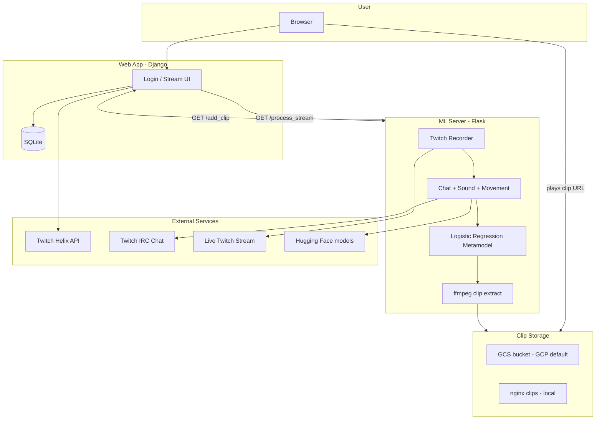

# VOD Tags — Twitch Stream Highlights Detection

**VOD Tags** is a two-part system that detects highlight moments during **live Twitch streams** using machine learning. A Django web app lets users track streams and view generated clips; an ML server records the broadcast, extracts features from chat/audio/motion, scores segments with a metamodel, and publishes highlight clips.

## What it does

1. User logs in and submits a Twitch channel name to track.
2. The web app validates the channel via Twitch Helix and notifies the ML server.
3. The ML server records the live stream, runs three parallel feature detectors, and merges features every ~10 seconds.
4. A logistic regression metamodel scores each window; high-probability segments become highlight clips.
5. Clips are published to storage (GCS or local nginx) and the web app displays them on the stream page.

## Architecture at a glance

## ML feature overview

| Signal | Source | Method |
|--------|--------|--------|
| **Chat** | Twitch IRC | Hugging Face sentiment pipeline → message counts & sentiment |
| **Sound** | Stream audio | librosa + PANNs audio tagging + loudness |
| **Movement** | Stream video | Dense optical flow + EfficientNet CNN |

Features are merged into 10-second windows and scored by a pre-trained logistic regression model (`model.joblib` + `standard_scaler.joblib`).

## Repository layout

| Path | Role |
|------|------|
| `webapp/` | Django project (UI, auth, stream/highlight DB) |
| `server/` | Flask ML server (record, detect, clip, callback) |
| `server/detector/` | Chat, sound, and movement feature extractors |
| `server/twitch_stream_recorder/` | Live stream capture via streamlink |
| `docker-compose.yml` | Local / container orchestration |
| `Dockerfile` / `Dockerfile.ml` | Web and ML container images |

Historical branches (metamodel training, movement POC) remain in git; `main` now includes both web and server.

## Deployment modes

| Mode | Doc |
|------|-----|
| **GCP (original)** | [Deployment → GCP](Deployment#gcp-original-default) |
| **Local Docker/Podman** | [Deployment → Local containers](Deployment#local-containers) |
| **Other cloud** | [Deployment → Cloud generic](Deployment#cloud-generic) |

## Wiki index

- [Architecture](Architecture) — components, APIs, and storage backends
- [Process Flow](Process-Flow) — step-by-step highlight lifecycle
- [ML Pipeline](ML-Pipeline) — detectors and metamodel details
- [Deployment](Deployment) — GCP, local, and container guides
- [Configuration](Configuration) — env vars and original config mapping

## Related reading

- [Original blog post](https://artkulakov.medium.com/how-i-created-an-app-for-live-stream-highlight-detection-for-twitch-532f4027987e)
- [Repository README](https://github.com/hefftv/VOD-tags/blob/main/README.md)
