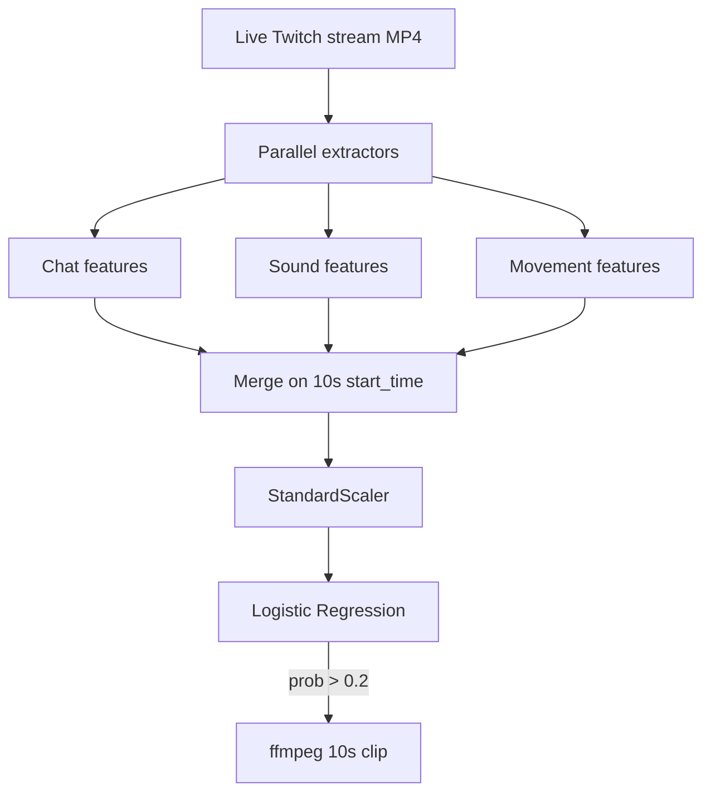
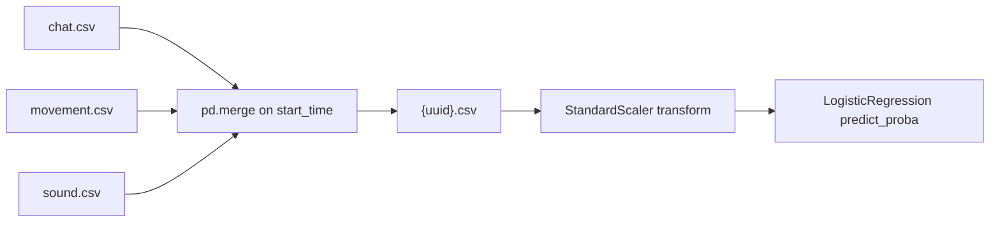

# ML Pipeline

The ML server transforms a live Twitch broadcast into time-windowed features, scores each window with a logistic regression metamodel, and triggers clip extraction for high-scoring segments.

## Pipeline overview

## Feature extractors

### 1. Chat detector (`server/detector/chat/chat.py`)

| Aspect | Detail |
|--------|--------|
| **Input** | Twitch IRC chat via `twitch.Chat` |
| **Model** | Hugging Face `pipeline('sentiment-analysis')` |
| **Window** | 10 seconds |
| **Output file** | `{uuid}_chat.csv` |

**Columns per window:**

| Column | Description |
|--------|-------------|
| `start_time`, `end_time` | Window boundaries |
| `message_counts` | Total messages |
| `positive_message_count` | POSITIVE sentiment count |
| `negative_message_count` | NEGATIVE sentiment count |

**Requires:** `TWITCH_CHAT_NICKNAME`, `TWITCH_OAUTH_TOKEN`

### 2. Sound detector (`server/detector/sound/sound.py`)

| Aspect | Detail |
|--------|--------|
| **Input** | Last ~3 seconds of audio from growing MP4 |
| **Tools** | ffmpeg extract → librosa → PANNs `AudioTagging` |
| **Labels** | AudioSet class labels (`class_labels_indices.csv`) |
| **Window** | 10 seconds |
| **Output file** | `{uuid}_sound.csv` |

**Notable columns:**

- `sound_loudness` — peak amplitude in window
- Audio tags: `Music`, `Speech`, `Gunshot, gunfire`, `Laughter`, `Thunder`, etc.

Sound features accumulate tag predictions across messages within the same 10s window.

### 3. Movement detector (`server/detector/movement/movement.py`)

| Aspect | Detail |
|--------|--------|
| **Input** | Video frames from growing MP4 |
| **Method** | Dense optical flow → EfficientNet CNN |
| **Model weights** | `detector/movement/effnet.h5` |
| **Window** | 10 seconds |
| **Output file** | `{uuid}_movement.csv` |

**Columns:**

| Column | Description |
|--------|-------------|
| `start_time`, `end_time` | Window boundaries |
| `movement_amount` | Aggregated motion score |

Optical flow frames are classified by a CNN trained to recognize movement intensity patterns (similar to the author's [workout movement counting](https://github.com/artkulak/workout-movement-counting) approach).

## Feature merge

Every scoring cycle (~30s), `StreamProcessor.check_predictions()`:

1. Waits until all three CSV files exist
2. Merges on `start_time` (drops duplicate `end_time` columns)
3. Writes combined `{uuid}.csv` for debugging

## Metamodel

| Artifact | File | Role |
|----------|------|------|
| Scaler | `standard_scaler.joblib` | Normalize feature columns |
| Classifier | `model.joblib` | Predict highlight probability |

**Algorithm:** Logistic regression (fast, interpretable)  
**Output:** `predict_proba(X)[:, 1]` — probability of highlight class  
**Selection:** Highest-probability unseen window with score **> 0.2**

Training code lives on branch `Feature/metamodel` (not required at runtime).

### Feature importances

The metamodel weights reflect which signals drive highlights for the training data:

Chat sentiment, gunfire/speech audio tags, and movement amount are among the strongest contributors.

## Clip extraction

When a window is selected:

1. Compute offset from stream start → `HH:MM:SS.0` ffmpeg `-ss` value
2. Run: `ffmpeg -ss {start} -i {input.mp4} -c copy -t 00:00:10.0 {clip.mp4}`
3. Publish via `publish_clip()` (GCS or local volume)
4. Callback web app with public URL

## Model dependencies (runtime downloads)

| Dependency | When fetched |
|------------|--------------|
| Hugging Face sentiment model | First chat detector run |
| PANNs inference weights | First sound inference |
| EfficientNet imagenet weights | Movement CNN load (if not cached) |
| `class_labels_indices.csv` | Bundled in ML Docker image at `/app/panns_data/` |

## Branch map (development history)

| Branch | Contents |
|--------|----------|
| `main` | Web app + server (current) |
| `Feature/server` | Original server-only branch |
| `Feature/metamodel` | Metamodel training notebooks/scripts |
| `Feature/movement` | Movement detection POC |

## Resource expectations

| Component | CPU | RAM | Notes |
|-----------|-----|-----|-------|
| Chat detector | Low | ~1 GB+ | transformers model |
| Sound detector | Medium | ~2 GB+ | PANNs + librosa |
| Movement detector | High | ~2 GB+ | OpenCV + TF/Keras CNN |
| Metamodel scoring | Low | Minimal | sklearn inference |

GPU is optional; the codebase runs on CPU. Container image uses Python 3.8 for TensorFlow 2.3 / Keras 2.4 compatibility.

## Related pages

- [Process Flow](Process-Flow) — when each stage runs
- [Architecture](Architecture) — where detectors fit in the system
- [Audio tagging reference](https://github.com/qiuqiangkong/audioset_tagging_cnn) — PANNs / AudioSet lineage
