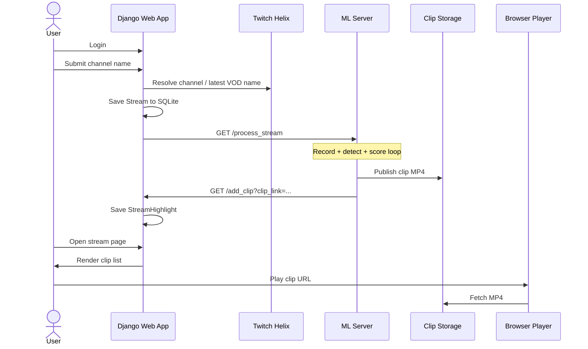
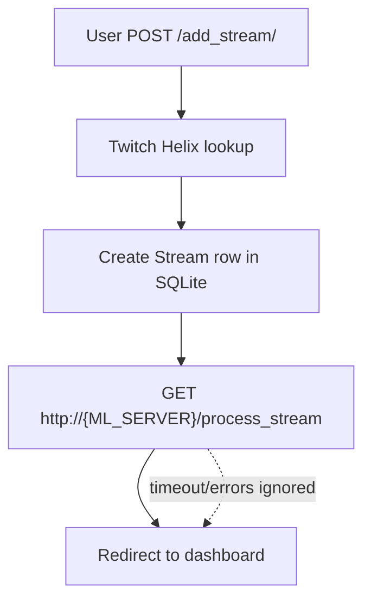
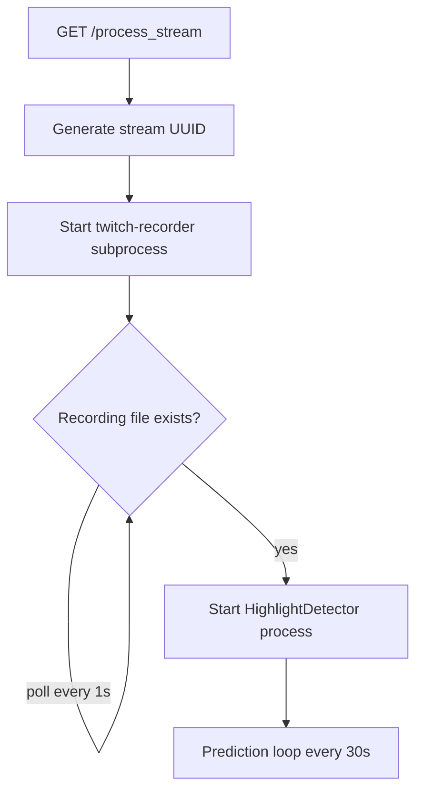
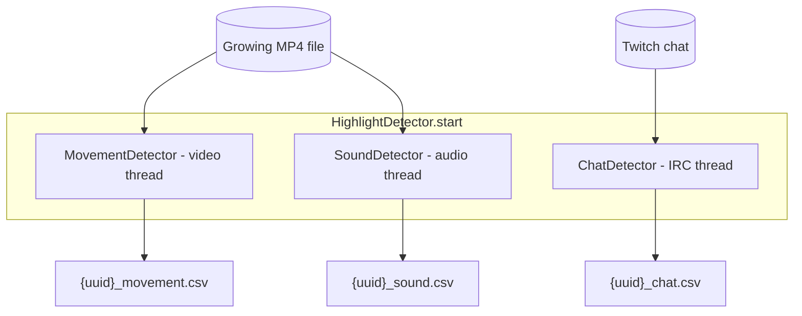
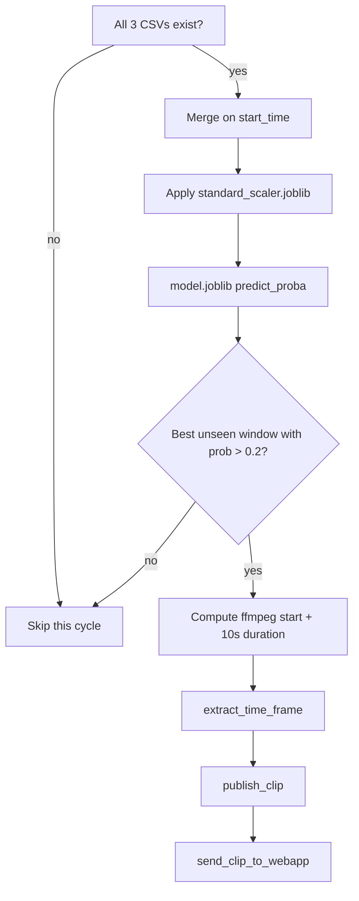
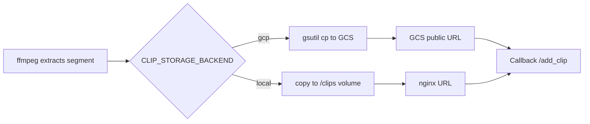
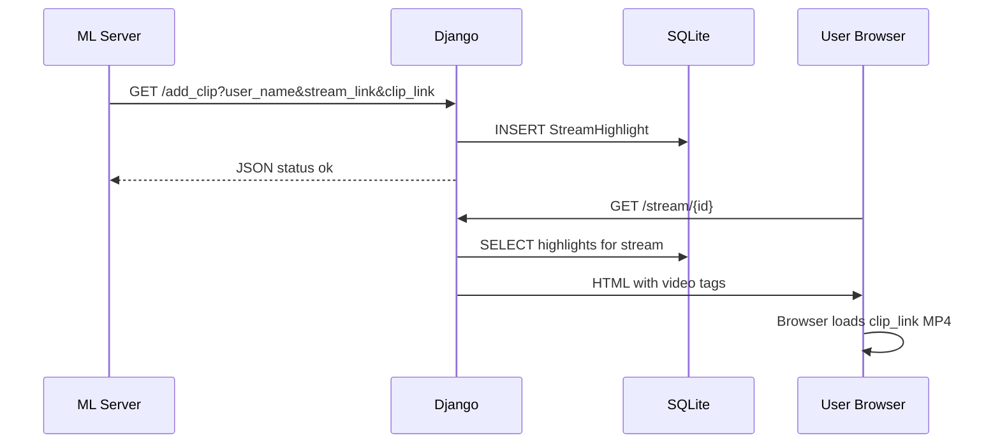

# Process Flow

This page walks through the full highlight lifecycle from user action to clip playback.

## User journey (high level)



## Phase 1 — Add stream (web app)

Triggered when a logged-in user submits a Twitch channel name on the dashboard.



**Inputs:** `stream_link` (channel name), authenticated username  
**Outputs:** `Stream` record; fire-and-forget ML trigger

Relevant code: `webapp/viewer/views.py` → `add_stream()`

## Phase 2 — Start processing (ML server)

The ML server receives `/process_stream` and starts a long-running pipeline for that channel.



**Recording path:** `{STREAMS_ROOT}/recorded/{channel}/{uuid}.mp4`  
**Requirement:** Target channel must be **live** on Twitch.

Relevant code: `server/server.py`, `server/processor.py` → `download_stream()`

## Phase 3 — Parallel feature extraction

Three detectors run concurrently while the recording grows:



Each detector appends **10-second windows** to its CSV with timestamp-aligned features.

| Detector | Reads | Writes | Update cadence |
|----------|-------|--------|----------------|
| Chat | IRC messages | Sentiment counts | Per message / window |
| Movement | Video frames | Optical flow + CNN score | ~1s poll loop |
| Sound | Last seconds of audio | PANNs tags + loudness | ~1s poll loop |

See [ML Pipeline](ML-Pipeline) for feature column details.

## Phase 4 — Metamodel scoring (every 30s)



**Highlight selection rules:**

- Sort windows by predicted probability (descending)
- Skip windows already published
- Threshold: probability > **0.2**
- Clip length: **10 seconds**

Relevant code: `server/processor.py` → `check_predictions()`, `publish_clip()`

## Phase 5 — Clip publish



| Backend | Public URL pattern |
|---------|-------------------|
| GCP | `https://storage.googleapis.com/{bucket}/{clip}.mp4` |
| Local | `http://localhost:8080/{clip}.mp4` |

## Phase 6 — Web callback and playback



The stream page renders each highlight as:

```html
<video src="{{ clip.clip_link }}"></video>
```

So `clip_link` must be a **browser-reachable** public URL.

## UI flow (screenshots)

### Login and add stream


### Stream appears on dashboard


### Highlights appear on stream page


## Timing diagram

```mermaid
gantt
  title Typical highlight pipeline timing
  dateFormat X
  axisFormat %S s

  section Recording
  Streamlink capture     :a1, 0, 3600

  section Features
  Chat CSV growing       :a2, 5, 3600
  Movement CSV growing   :a3, 10, 3600
  Sound CSV growing      :a4, 10, 3600

  section Scoring
  First score attempt    :milestone, 30, 0
  Score every 30s        :a5, 30, 3600

  section Clip
  ffmpeg extract ~10s    :a6, 35, 45
  Publish + callback     :a7, 45, 50
```



First highlights typically appear **after** all three feature CSVs exist and the first 30-second scoring cycle finds a window above threshold. Exact timing depends on stream length, model confidence, and infrastructure latency.

## Failure modes

| Symptom | Likely cause |
|---------|--------------|
| Stream added but no clips | Channel offline; ML unreachable; missing Twitch creds |
| Clips in DB but won't play | `clip_link` not public / wrong `CLIP_PUBLIC_BASE_URL` |
| No chat features | Invalid `TWITCH_OAUTH_TOKEN` or nickname |
| GCP clips fail | Missing `gsutil`, bucket permissions, or private bucket |

See [Configuration](Configuration) and [Deployment](Deployment) for environment-specific setup.
